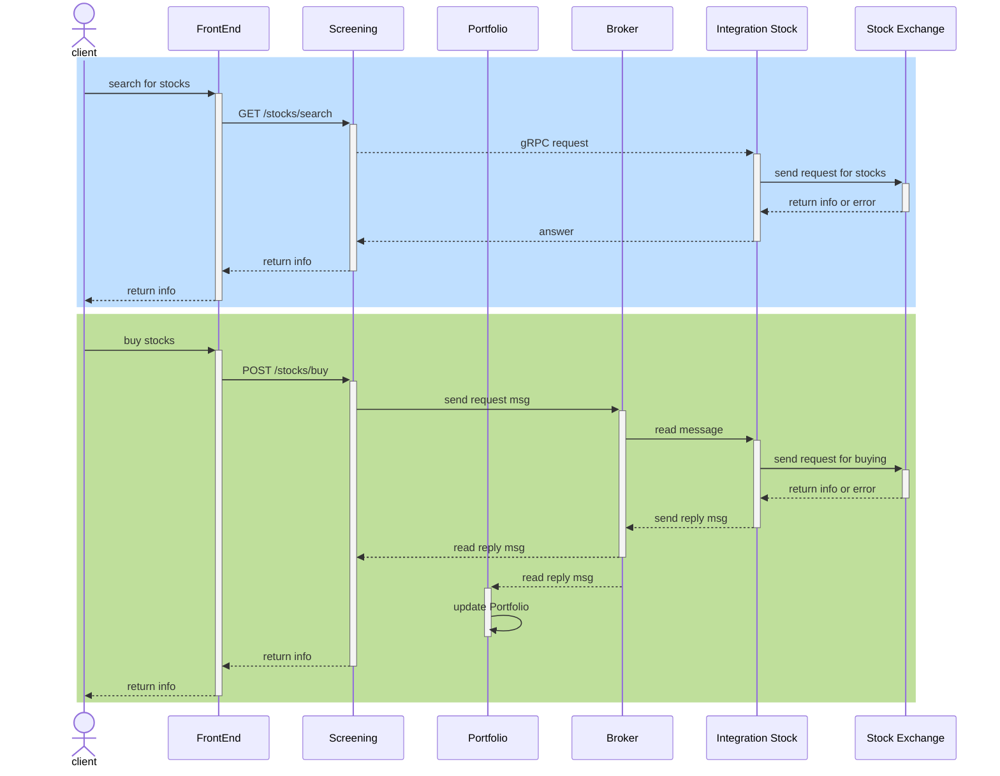

## Task 3.1

{}
What advantages and disadvantages of microservices do you know?
{}

### Advantages

* It's **easier to add new functions**, because developers could add another microservice and don't be afraid of
* It's **easier to scale** microservices than monolith application, because you can add new instance independently
* It's **easier to support** small, independent services than one huge application
* Microservises architecture **is more fail-safe**, because even if one service is down the others are still function
* Microservises allow to **implement CI/CD process with different flows for each services**, because each service could be started and shге down separately
* Different teams could use **different technologies and their own prodaction cycle** for each service

### Disadvantages

* It's **hard to design the right set of services** \
    It could be distributed monolith instead of microservices, which leads to strong connections between services. 
* It's more **difficult to start developing and testing**, espesially for the first period \
    The team must prepare all the enviroment for different microservices (including message brokers, DB for each service, etc.)
* It's **hard to coordinate a huge amount of services**, espesially if there are distributed transactions \
    The team must be prepared for using special monitoring software for all microservices
* There is **extra latency during inter-service communication** because microservices uses high level API.

## Task 3.2

{}
Depict the top-level architecture of the trading application (e.g. _Tinkoff Investing_ or any similar)
{}

Main function of application like _Tinkoff Investing_ is integration with different types of stocks, banks and oters and creating user's portfolio.

So we need to create an integration layer for our application. It could be represented as a number of microservices, one for every external application.

Also there are some microservices:
* **Portfolio** - information about user's stock. This is one of main module - it's aggregate all information about user's assets.
* **Profile** - information about user's profile.
* **Screening** - service, that accumulate information about stocks and assets from the different sources. It's also get the user's request and send them to the Integration layer via message broker.
* **Integration_service_n** - one of the integration services, that send (and recieve) information to the external systems.
* etc.

> I described only the main services, but there could be more of them for: news, chat, statistic, etc.

The simple scheme for such an application:

> Use information from this source: https://htc-cs.ru/portfolio/ecommerce/mobilnoe-prilozhenie-tinkoff-investitsii 

## Task 3.3

{}
Choose any process that is typical for this type of service and depict its flow in BPMN or sequence diagram
{}

Let's describe process of buying stocks for portfolio in web application. There are two parts:
* Get the information about stocks from Stock Exchange
* Send infromation for buying stock

> It's very simple process without any specific technical details

